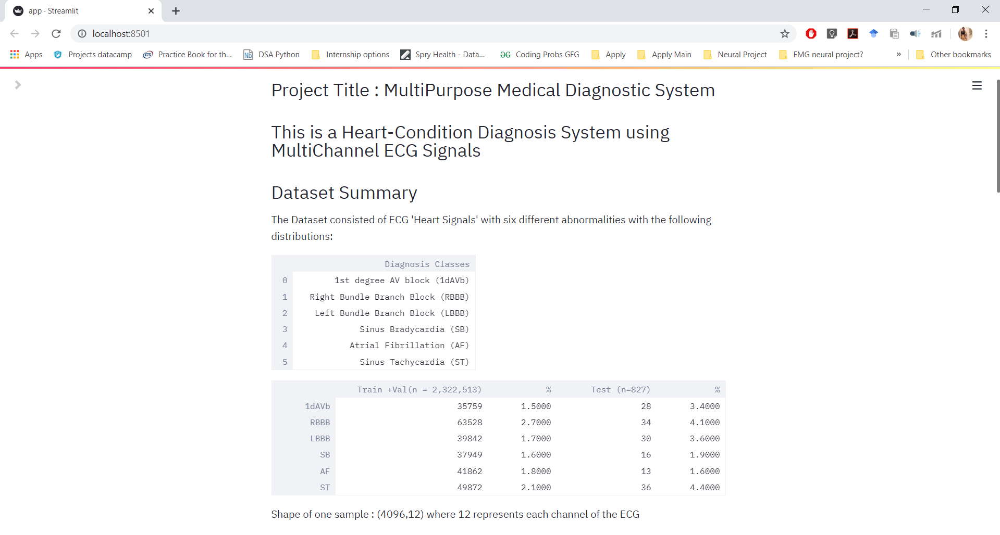
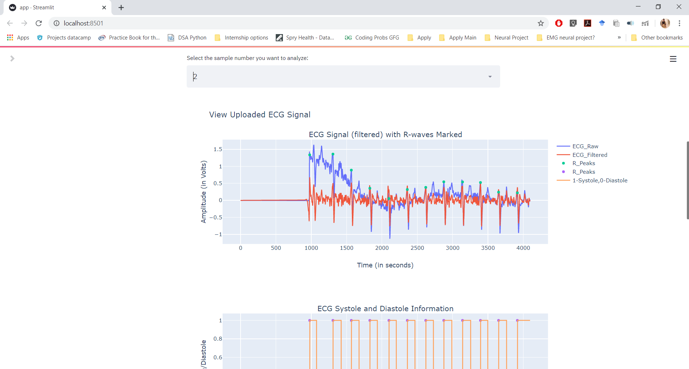
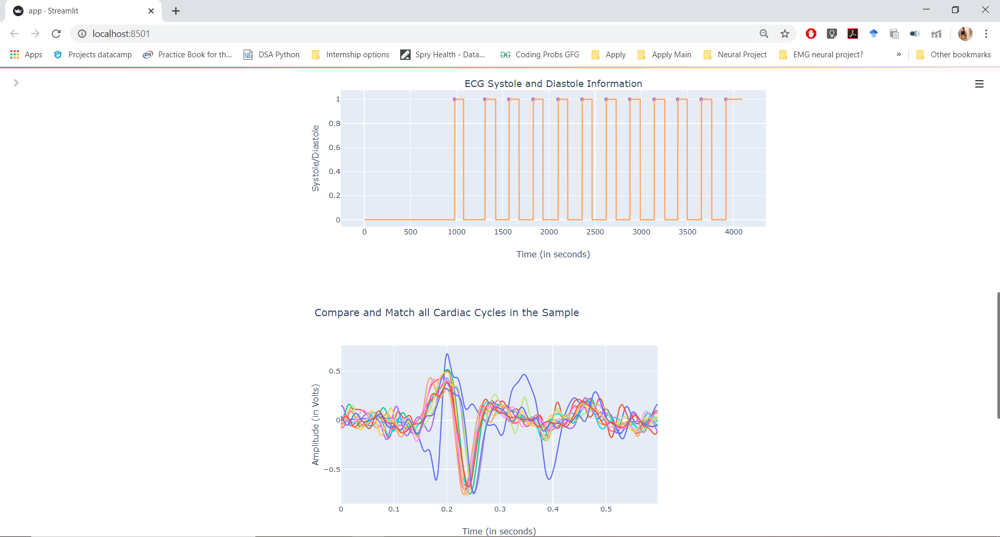
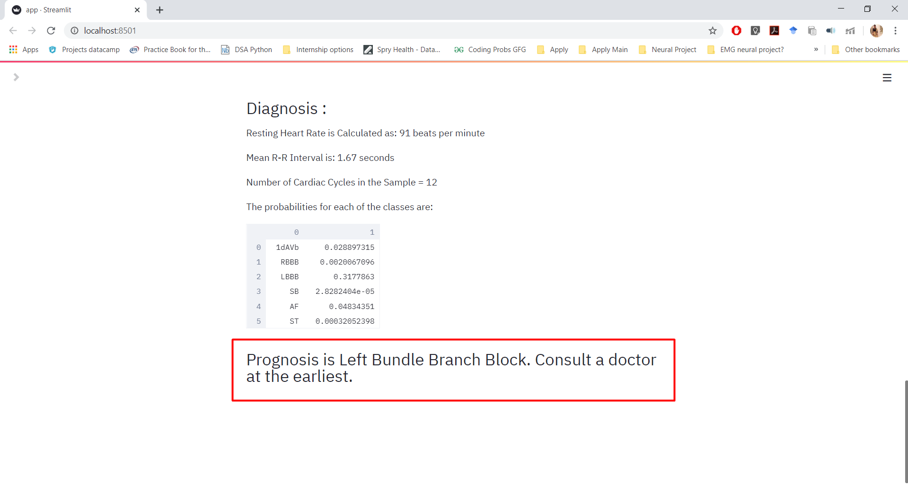

# ECG-Diagnostic-System
A simple demo of how an automatic ECG diagnosis system would look from a user perspective. It gives basic analysis and a preliminary diagnosis of 6 classes.

This system offers an analysis of the input signal using the neurokit module and uses plotly for stunning and compelling visualizations.
Streamlit is used to host everything for now. It will be pushed to development soon.

### The server opens up to this page and you can see the details of the dataset used and the 6 classes it diagnoses (apart from the "Normal" class).

### Import the ECG data from hdf5 files to get visualizations as follows:
- raw ECG data
- filtered ECG using a butterworth filter
- R peak detection
- view of the systole/diastole durations across the signal
- views of the caridac cycles, overlapped and centred

### You also get the following analyses:
- Resting Heart Rate calculation
- Mean R-R Intevral
- Number of cardiac cycles in the sample

and finally, 
#### - the probabilities of the signal showing any of the abnormalities and the recommendation for the final diagnosis.

<b> Run app.py to get the entire visualization.

The code for the ResNet was obtained from https://github.com/antonior92/automatic-ecg-diagnosis

